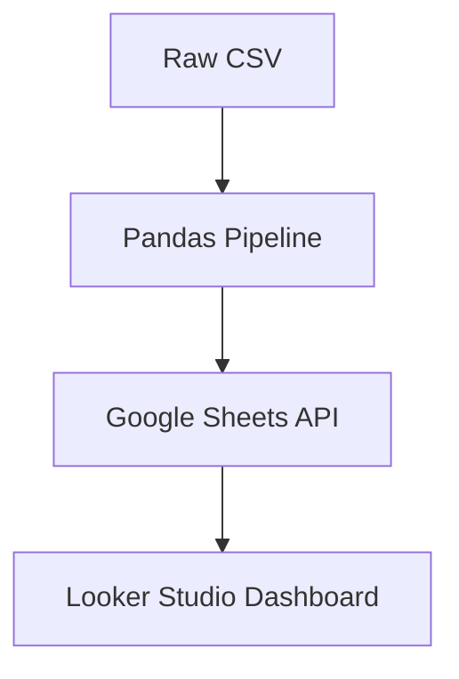

## 🏗️ Project Overview

In construction project management, keeping track of contract statuses across various stages is critical for cash flow and vendor management. This project automates the extraction, transformation, and visualization of contract lifecycles.

---

## 🔄 Lifecycle Stages Tracked

Every contract passes through one of eight operational phases:

| Phase | Phase Name | Description |
| :--- | :--- | :--- |
| **1** | `GENERATING` | Draft generated from raw CSV details |
| **2** | `NEGOTIATING` | Scope and pricing review under negotiation |
| **3** | `DOWNPAYMENT` | Initial deposit paid by client |
| **4** | `DEVELOPMENT` | Construction actively underway |
| **5** | `QUALITY_CHECK` | Site inspection & compliance review |
| **6** | `FINISHING` | Final punch-list item fixes |
| **7** | `FULLPAYMENT` | Remaining balance settled & completed |
| **X** | `DISCONTINUED` | Terminated or cancelled contracts |

---

## 🔄 Contract Flow Diagram



## 🐍 Python Transformation Pipeline

We use **Pandas** to clean raw CSV inputs, infer contract stages, and push structured rows directly to the **Google Sheets API**.

```python
import pandas as pd
import gspread

# 1. Load raw CSV export
df = pd.read_csv("data/raw_contracts.csv")

# 2. Exploratory Data Analysis & Transformation
df['contract_num'] = df['contract_num'].astype(str).str.strip()
df['status'] = df['status'].fillna('GENERATING').str.upper()

# Filter active contracts
active_contracts = df[df['status'] != 'DISCONTINUED']

print(f"Total Active Contracts Processed: {len(active_contracts)}")

# 3. Export to Google Sheets API
gc = gspread.service_account(filename='credentials.json')
sh = gc.open("Construction_Contract_DB").sheet1
sh.update([df.columns.values.tolist()] + df.values.tolist())